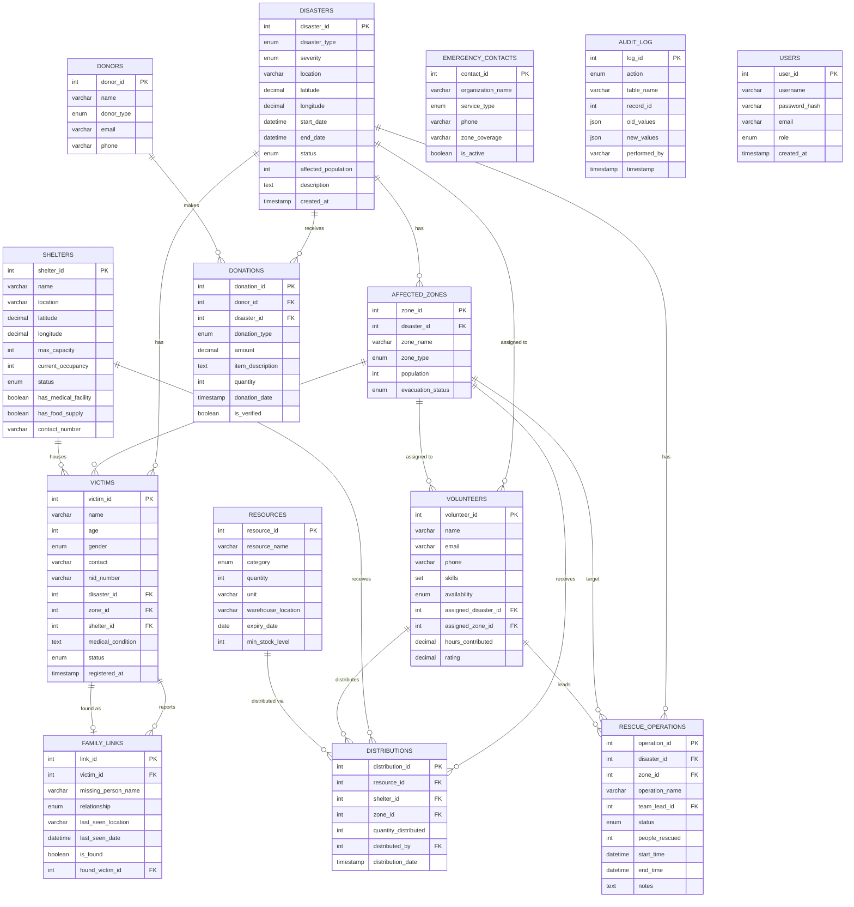

# ER Diagram — Disaster Response & Relief Coordination System

## Entity Relationship Diagram (Mermaid)

## Relationships Summary

| Relationship | Cardinality | Description |
|---|---|---|
| disasters → affected_zones | 1:N | Each disaster has multiple affected zones |
| disasters → victims | 1:N | Each disaster has multiple victims |
| disasters → volunteers | 1:N | Volunteers are assigned to disasters |
| disasters → donations | 1:N | Disasters can receive multiple donations |
| disasters → rescue_operations | 1:N | Each disaster has multiple rescue operations |
| affected_zones → victims | 1:N | A zone contains multiple victims |
| affected_zones → distributions | 1:N | Resources distributed to zones |
| shelters → victims | 1:N | A shelter houses multiple victims |
| shelters → distributions | 1:N | Resources distributed to shelters |
| victims → family_links | 1:N | A victim can report multiple missing persons |
| volunteers → distributions | 1:N | A volunteer handles multiple distributions |
| volunteers → rescue_operations | 1:N | A volunteer leads multiple operations |
| resources → distributions | 1:N | A resource can be distributed multiple times |
| donors → donations | 1:N | A donor can make multiple donations |

## Key Design Decisions

1. **Audit Log**: JSON columns store old/new values for full change history
2. **Soft relationships**: Victims can exist without a shelter or zone (nullable FKs)
3. **Family Links self-reference**: `found_victim_id` references back to victims table for reunification
4. **SET type for skills**: MySQL SET type allows multiple skills per volunteer
5. **CHECK constraint**: `shelters.current_occupancy <= max_capacity` enforces capacity limits
6. **Haversine formula**: Used in `FindNearestShelter` procedure for accurate distance calculation
